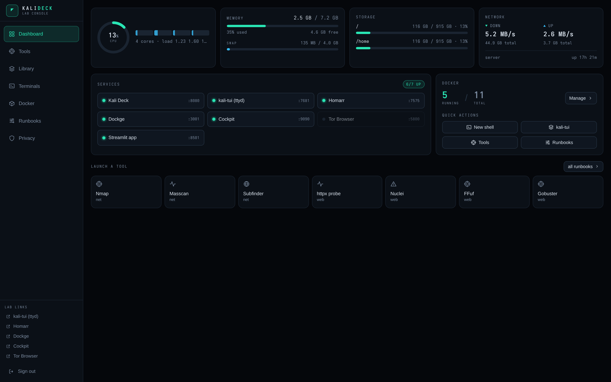
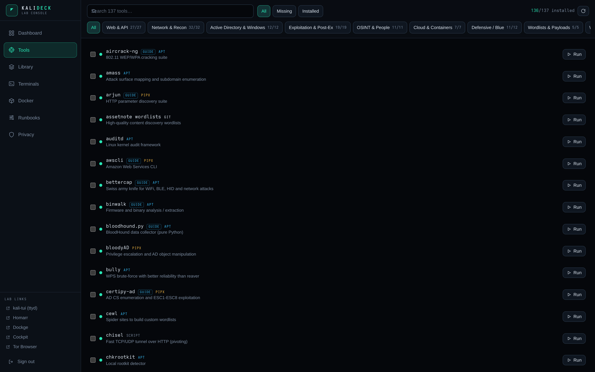
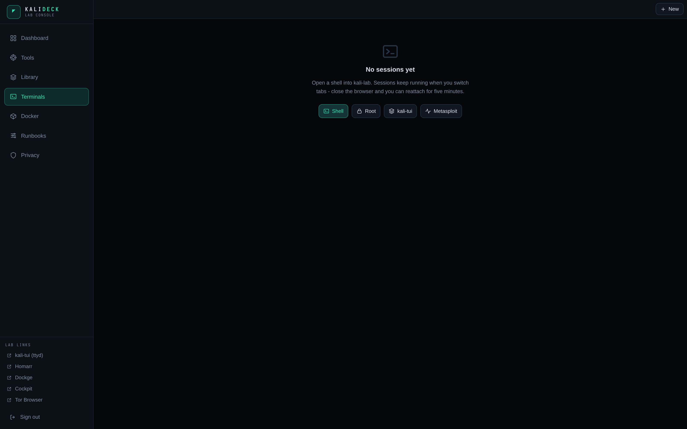
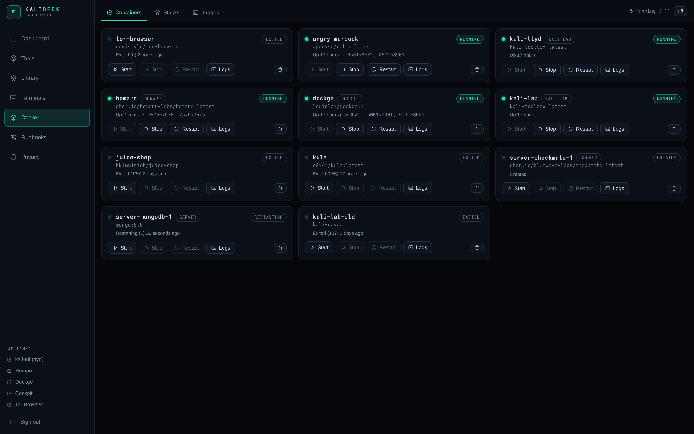

# Kali Deck

A web console for a Kali Linux lab. Tool catalog, real terminals, Docker
management, and VPN/Tor controls in one password-gated interface, built for
use from a laptop or a phone.

Kali Deck runs on a Linux host and drives the `kali-lab` container over the
Docker API. The browser never gets a shell on the host.

<p align="center">
  
</p>

```
 phone / laptop ──HTTPS──▶ Tailscale ──▶ 127.0.0.1:8080  kali-deck (this app)
                                               │
                        ┌──────────────────────┼───────────────────────┐
                        ▼                      ▼                       ▼
              Docker API (unix socket)   PTYs in kali-lab        host commands
              containers, stacks,        zsh / kali-tui /        protonvpn,
              logs, images               msfconsole / ad-hoc     /etc/resolv.conf
```

For targets you own or are authorized to test. You are responsible for
complying with the law where you live.

## Screenshots

| Tools | Terminals |
|---|---|
|  |  |
| **Docker** | **Privacy** |
|  |  |

## Setup

```bash
git clone https://github.com/ayush-rdev/kalideck.git
cd kalideck
bash setup.sh
```

The script detects what is missing and installs it: Docker, Node.js 20, the
`kali-toolbox` image, the lab containers, the deck's dependencies, the
production UI build, and a systemd service. Re-running it is always safe.

Flags:

```bash
bash setup.sh --deck-only   # web console only, skip the image build
sudo bash setup.sh --system # system service + Tailscale HTTPS publish
```

When it finishes, open `http://127.0.0.1:8080/` and read the password:

```bash
grep DECK_PASSWORD kali-deck/.env
```

If `DECK_PASSWORD` was unset, the backend generated one on first boot and
saved it there. Change it by editing that file.

Requirements, the manual equivalent of every step, and the VPN/Tor setup
notes live in [REQUIREMENTS.md](REQUIREMENTS.md).

## Components

| | |
|---|---|
| [`kali-deck/`](kali-deck/) | The console. Express backend (API + WebSocket terminals and jobs) serving a React, Vite and Tailwind PWA. |
| [`kali-lab/`](kali-lab/) | The lab it drives. A Kali toolbox image with ~60 tools baked in from `catalog.json`, a Python installer, and a curses TUI. |

The interface: a dashboard with host metrics and service health, the tool
catalog with live-streamed installs, a recipe-driven tool runner, terminals
(zsh, root, msfconsole, ad-hoc) with server-side scrollback, Docker and
Compose management with log streaming, multi-step runbooks, and a privacy
page for Tor, WireGuard and ProtonVPN.

Long-running work — installs, compose, log follows, ad-hoc runs — happens as
a job with a WebSocket stream, so you can navigate away and come back to the
same output. WebSockets reconnect on their own; polling pauses when the tab
is hidden.

## Reaching it from other devices

The backend binds loopback only. Two clean ways in:

```bash
# Tailscale: HTTPS on your tailnet, works from anywhere
sudo kali-deck/deploy.sh        # prints https://<machine>.<tailnet>.ts.net/

# SSH tunnel: nothing else to install
ssh -N -L 8080:127.0.0.1:8080 user@<server-ip>
```

`DECK_HOST=0.0.0.0` exposes the login page to the LAN; see the security
notes before using it.

## Fixing things

Diagnose in this order — most issues are one of these five:

**1. Which service is running, and is it alive?**

```bash
systemctl --user status kali-deck     # user-service install (setup.sh default)
systemctl status kali-deck            # system install (setup.sh --system)
journalctl --user -u kali-deck -n 50  # recent backend logs
```

**2. Is the backend actually up?** `curl -s http://127.0.0.1:8080/api/health`
should print `{"ok":true,...}`. If not, the logs above say why — the common
ones are a missing `dist/` build and a Docker socket the user cannot read.

**3. Is the container up?** `docker ps | grep kali-lab` — if not,
`docker start kali-lab` (or re-run `setup.sh`). A terminal that "opens then
instantly exits" is almost always this.

**4. Can you reach the port?** The deck binds `127.0.0.1` only. From another
machine, use a tunnel (`ssh -N -L 8080:127.0.0.1:8080 user@<server-ip>`) or
Tailscale. If you switched to `DECK_HOST=0.0.0.0` and now get nothing, check
the unit's `Environment=` line and `systemctl daemon-reload`.

**5. Rebuild from a clean slate.** When the state feels cursed:

```bash
cd kali-deck && rm -rf node_modules dist && npm install && npm run build
# then restart the service from step 1
```

Specific symptoms:

| Symptom | Fix |
|---|---|
| `UI not built yet` in the browser | `cd kali-deck && npm run build` |
| Blank page after deploy | confirm `kali-deck/dist/` exists, restart the service |
| `docker api timeout` / API 500s | put your user in the `docker` group, log out and back in |
| Terminal opens then exits | container is down — `docker start kali-lab` |
| Installs hang | the container needs egress; check VPN/Tor routing on the Privacy page |
| VPN buttons say sudo needs a password | `sudo kali-deck/setup-sudo.sh` |
| No tailnet URL from `deploy.sh` | `sudo tailscale up` first, then re-run `deploy.sh` |
| Service dies at logout | `sudo loginctl enable-linger $USER` (user-service path) |

## Extending it

**Add a tool.** Append an entry to
[`kali-lab/catalog.json`](kali-lab/catalog.json) — id, name, category, the
binary to probe, an install spec (`apt`, `pipx`, `go`, `pip`, `gem`,
`cargo`, `git` or `script`), and optional runner recipes. Re-run `setup.sh`
or `kalitools install <id>`; the Tools, Library and Runner pages pick it up
on refresh.

**Add a page.** Drop a component in `kali-deck/web/src/pages/`, register it
in `web/src/App.jsx`, and add API routes in `server/index.js`. `npm run dev`
plus `npm run dev:web` gives you hot reload for both sides.

**Add a runbook.** They live in `kali-deck/web/src/lib/runbooks.js` — a
list of steps that open terminals or run commands, nothing more.

**Rebuild the image.** `docker build -t kali-toolbox:latest kali-lab/`
(`--build-arg KALI_BASE=kalilinux/kali-rolling` on a fresh machine,
`KALITOOLS_SKIP_INSTALL=1` to skip the tool bake).

## Security model

- Session cookie is `HttpOnly; SameSite=Strict`; sessions are in-memory, so a
  restart means logging in again. Logins are rate-limited per IP.
- State-changing API calls are same-origin checked.
- `kali-lab` is not privileged: only `NET_ADMIN`, `NET_RAW`, `SYS_PTRACE`.
- VPN control uses two narrow sudoers rules, installed by
  [`kali-deck/setup-sudo.sh`](kali-deck/setup-sudo.sh), revocable with
  `sudo rm /etc/sudoers.d/kali-deck`. WireGuard keys never leave the kernel;
  the deck sees interface names and state only.
- Tor SOCKS listens inside the container on loopback; the tor-browser noVNC
  port binds `127.0.0.1` only.

## License

[MIT](LICENSE)
